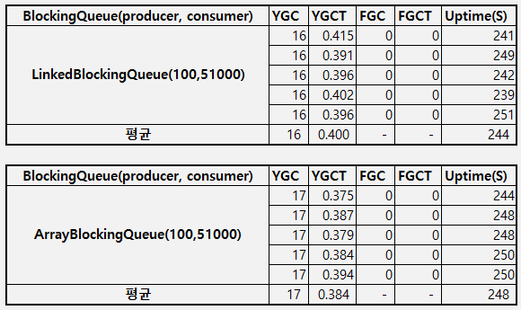
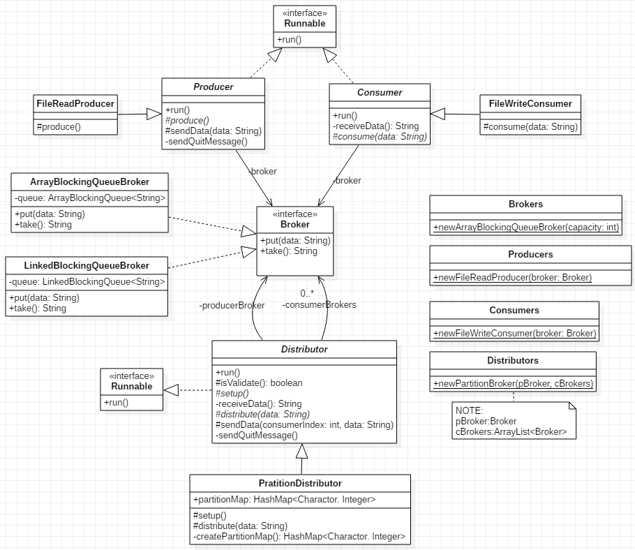

# producer-consumer
## 요구사항
* **Maven** 기반으로 프로젝트 구성
* **SOLID** 원칙 준수
* 프로그램 종료시 **사용된 리소스를 올바르게 정리**
* 프로그램 실행 **argument로 3개**의 값을 입력
  * 처리해야 할 파일경로
  * 결과 파일들을 저장 할 디렉토리 경로
  * 병렬 처리를 위한 파티션 수 **(1 < N < 27)** 
* Producer-Consumer 디자인 패턴 응용
  * Producer 요구 사항
    1. 파일에서 각 라인을 읽어온다.
    2. 각 라인의 주어진 단어가 유효한지 **정규표현식을 활용**해 검사한다.
       * **단어는 알파벳으로 시작**
       * **대소문자 구분하지 않음**
       * **알파벳 외 문자로 시작하는 단어는 유효하지 않음**            
             예) ab!23 (유효함), A12bd (유효함), 123abc (유효하지않음)
    3. **유효하지 않은 단어들은 처리를 생략**한다.
    4. 유효한 단어들은 **N개의 파티션으로 나눠서 Consumer에 전달**한다.
       * **동일한 단어는 항상 동일한 파티션에 포함**되야 한다.
   * Consumer 요구사항
     1. 파티션에서 **순차적**으로 단어를 1개씩 가져온다.
     2. **단어의 첫 알파벳에 해당하는 파일이 존재하지 않으면 새로 만들고, 존재한다면 기존 파일 끝에 주어진 단어를 추가한다.(대소문자 구분 없음)**
         예) 단어가 apple 또는 Apple이라면 a.txt 파일에 해당 단어를 append

## 제약사항
* Java, **JDK8 이상** 사용
* **JDK 만으로 구현**하고 서드 파티 프레임워크/라이브러리는 일절 사용 금지
      
## 주요 고려사항
* Producer와 Consumer 사이의 데이터 교환은 어떻게 할 것인가?
  * Thread 사이에서 작업을 조율하는 용도로 blocking queue가 존재한다.
  * java의 BlockingQueue 종류
     * **ArrayBlockingQueue**
         * Array로 구현된 Queue
         * 생성 후 크기변경 불가하다.
     * **LinkedBlockingQueue**
         * Linked list로 구현된 Queue
         * 유동적으로 queue의 크기를 가진다.
     * PriorityBlockingQueue
         * 자동으로 정렬을 수행하는 Queue로 Consumer의 **순차적 처리 요구사항에 위반**되므로 사용 불가하다.
     * SynchronousQueue
         * insert 작업과 remove 작업이 반드시 동시에 일어나는 Queue
         * Producer와 Consumer의 처리 속도가 동일하지 않을 수 있으므로 적합하지 않다.
   * ArrayBlockingQueue vs LinkedBlockingQueue
	   * 비교 결과 성능에 큰 차이가 없고, Broker 특성상 사이즈가 유동적이므로 LinkedBlockingQueue가 유리하다고 판단된다.
	   * 5회 테스트 후 평균값 비교 	   
	    
* Producer에서 N개의 파티션으로 나눠서 Consumer에 어떻게 전달할 것인가?
  * Distributor를 중간에 놓고, Producer에서 생산된 데이터를 Consumer로 분배하는 역할을 수행하게 한다. 
* 프로그램 종료시 사용된 리소스를 어떻게 정리할 것인가?
  * Producer에서 모든 단어를 전달 후 마지막으로 종료 시그널을 전송한다.
  * 종료 시그널을 받은 Distributor는 등록된 모든 Consumer에 종료 시그널을 전송하고 종료한다.
  * 종료 시그널을 받은 Consumer는 종료한다.
  * 종료 시그널은 단어로 올 가능성이 없는 문자로 선정 : !q

## 클래스 설계
